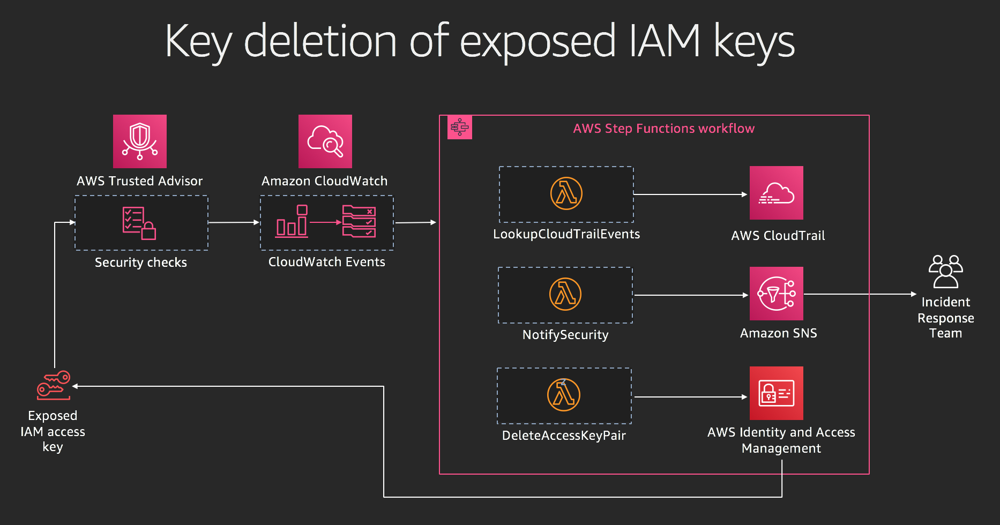
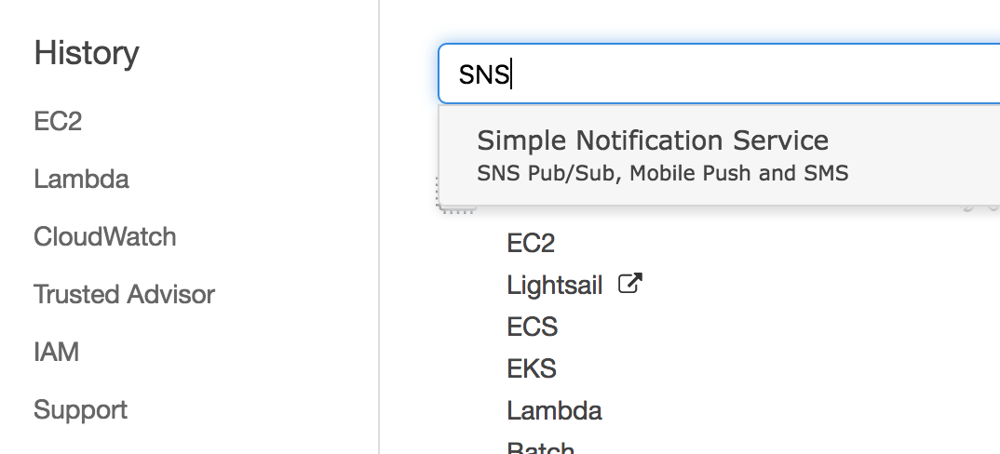
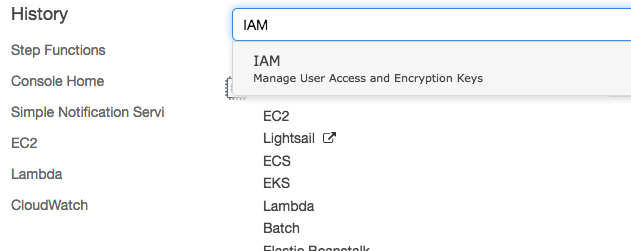
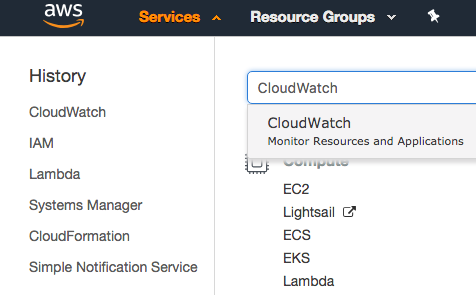

## Trusted Advisor Key rotation of IAM exposed keys

Trusted Advisor checks popular code repositories for access keys that have been exposed to the public and for irregular Amazon Elastic Compute Cloud (Amazon EC2) usage that could be the result of a compromised access key.  

On detection of a Trusted Advisor Exposed Access Key CloudWatch Event this workflow deletes the exposed IAM Access Key, summarizes the recent API activity for the exposed key, and sends the summary message to an Amazon SNS Topic to notify the subscribers.

These steps will go through the how to set up the workflow described above.




### Step 1 Creating the Lambda Function to delete an IAM key.
<details>
<summary>**[ Click here for detailed steps ]**</summary><p>

1. From AWS console, click on Services and type in Lambda in the search bar and press enter. 
2. Click on **Create Function** 
3. Type in your function name. **Example**: *ta-deleteiamkey*
4. Set Runtime to **Python3.6**
5. Select Create custom role, on the newly opened page input a **Role Name**. **Example:** *ta-iam-role* 
6. On the newly opened page, click on **View Policy Document** and then **Edit**
7. Copy and paste below IAM Role and click **Allow**

IAM Role

```
{
     "Version": "2012-10-17",
     "Statement": [
         {
             "Sid": "Stmt1477516473539",
             "Action": [
                 "logs:CreateLogGroup",
                 "logs:CreateLogStream",
                 "logs:PutLogEvents"
             ],
             "Effect": "Allow",
             "Resource": "arn:aws:logs:*:*:*"
		   }, {

				"Sid": "Stmt1477680111144",
				"Action": [
    				"iam:DeleteAccessKey"
				],
				"Effect": "Allow",
				"Resource": "*"
			} 
		]
}
 
```

8. Click on **Create Function**.
9. Copy Paste below Lambda Function Code and click **Save**.


```
import boto3

iam = boto3.client('iam')


def lambda_handler(event, context):
    account_id = event['account']
    time_discovered = event['time']
    details = event['detail']['check-item-detail']
    username = details['User Name (IAM or Root)']
    access_key_id = details['Access Key ID']
    exposed_location = details['Location']
    print('Deleting exposed access key pair...')
    delete_exposed_key_pair(username, access_key_id)
    return {
        "account_id": account_id,
        "time_discovered": time_discovered,
        "username": username,
        "deleted_key": access_key_id,
        "exposed_location": exposed_location
    }


def delete_exposed_key_pair(username, access_key_id):
    """ Deletes IAM access key pair identified by access key ID for specified user.
    Args:
        username (string): Username of IAM user to delete key pair for.
        access_key_id (string): IAM access key ID to identify key pair to delete.
    Returns:
        (None)
    """
    try:
        iam.delete_access_key(
            UserName=username,
            AccessKeyId=access_key_id
        )
    except Exception as e:
        print(e)
        print('Unable to delete access key "{}" for user "{}".'.format(access_key_id, username))
        raise(e)
```

</p></details>

### Step 2 Creating the Lambda Function to lookup Cloud Trail events.
<details>
<summary>**[ Click here for detailed steps ]**</summary><p>

1. From AWS console, click on Services and type in Lambda in the search bar and press enter. 
2. Click on **Create Function** 
3. Type in your function name. **Example**: *ta-lookupctrail*
4. Set Runtime to **Python3.6**
5. Select Create custom role, on the newly opened page input a **Role Name**. **Example:** *ta-ctrail-role* 
6. On the newly opened page, click on **View Policy Document** and then **Edit**
7. Copy and paste below IAM Role and click **Allow**

IAM Role

```
{
     "Version": "2012-10-17",
     "Statement": [
         {
             "Sid": "Stmt1477516473539",
             "Action": [
                 "logs:CreateLogGroup",
                 "logs:CreateLogStream",
                 "logs:PutLogEvents"
             ],
             "Effect": "Allow",
             "Resource": "arn:aws:logs:*:*:*"
		   }, {

				"Sid": "Stmt1477680111144",
				"Action": [
    				"cloudtrail:LookupEvents"
				],
				"Effect": "Allow",
				"Resource": "*"
			} 
		]
}

```

8. Click on **Create function**
9. Copy Paste below Lambda Function Code and click **Save**


```
import datetime
import collections
import boto3

cloudtrail = boto3.client('cloudtrail')


def lambda_handler(event, context):
    account_id = event['account_id']
    time_discovered = event['time_discovered']
    username = event['username']
    deleted_key = event['deleted_key']
    exposed_location = event['exposed_location']
    endtime = datetime.datetime.now()  # Create start and end time for CloudTrail lookup
    interval = datetime.timedelta(hours=24)
    starttime = endtime - interval
    print('Retrieving events...')
    events = get_events(username, starttime, endtime)
    print('Summarizing events...')
    event_names, resource_names, resource_types = get_events_summaries(events)
    return {
        "account_id": account_id,
        "time_discovered": time_discovered,
        "username": username,
        "deleted_key": deleted_key,
        "exposed_location": exposed_location,
        "event_names": event_names,
        "resource_names": resource_names,
        "resource_types": resource_types
    }


def get_events(username, starttime, endtime):
    """ Retrieves detailed list of CloudTrail events that occured between the specified time interval.
    Args:
        username (string): Username to lookup CloudTrail events for.
        starttime(datetime): Start of interval to lookup CloudTrail events between.
        endtime(datetime): End of interval to lookup CloudTrail events between.
    Returns:
        (dict)
        Dictionary containing list of CloudTrail events occuring between the start and end time with detailed information for each event.
    """
    try:
        response = cloudtrail.lookup_events(
            LookupAttributes=[
                {
                    'AttributeKey': 'Username',
                    'AttributeValue': username
                },
            ],
            StartTime=starttime,
            EndTime=endtime,
            MaxResults=50
        )
    except Exception as e:
        print(e)
        print('Unable to retrieve CloudTrail events for user "{}"'.format(username))
        raise(e)
    return response


def get_events_summaries(events):
    """ Summarizes CloudTrail events list by reducing into counters of occurences for each event, resource name, and resource type in list.
    Args:
        events (dict): Dictionary containing list of CloudTrail events to be summarized.
    Returns:
        (list, list, list)
        Lists containing name:count tuples of most common occurences of events, resource names, and resource types in events list.
    """
    event_name_counter = collections.Counter()
    resource_name_counter = collections.Counter()
    resource_type_counter = collections.Counter()
    for event in events['Events']:
        resources = event.get("Resources")
        event_name_counter.update([event.get('EventName')])
        if resources is not None:
            resource_name_counter.update([resource.get("ResourceName") for resource in resources])
            resource_type_counter.update([resource.get("ResourceType") for resource in resources])
    return event_name_counter.most_common(10), resource_name_counter.most_common(10), resource_type_counter.most_common(10)
```

</p></details>

### Step 3 Creating the SNS topic to notify interested parties.
<details>
<summary>**[ Click here for detailed steps ]**</summary><p>

1. From AWS console, click on Services and type in SNS in the search bar and press enter. 
2. If this is the first time using SNS click **Get started**
3. Click on **Topics**.
4. Click on **Create new topic**
5. Enter a **Topic Name** and **Display Name**. **Example**: *ta-key-del*
6. Click on **Create Topic**.
7. From the topic list, note down the newly created topic ARN.
8. Select the newly created topic.
9. Click **Actions**, then select **Subscribe to topic**
10. From the **Protocol** dropdown menu select Email. Input your email in the endpoint field. 
11. Click **Create subscription**, you will receive a Subscription Confirmation email on the email address specified above.

</p></details>

### Step 4 Creating Lambda Function to compose the message and invoke the SNS topic.
<details>
<summary>**[ Click here for detailed steps ]**</summary><p>

1. From AWS console, click on Services and type in Lambda in the search bar and press enter. 
2. Click on **Create Function**.
3. Type in your function name. **Example**: *ta-messagesns*
4. Set Runtime to **Python3.6**
5. Select Create custom role, on the newly opened page input a **Role Name**. **Example:** *ta-sns-role* 
6. On the newly opened page, click on **View Policy Document** and then **Edit**
7. Copy and paste below IAM Role and click **Allow**
IAM Role


```
{
     "Version": "2012-10-17",
     "Statement": [
         {
             "Sid": "Stmt1477516473539",
             "Action": [
                 "logs:CreateLogGroup",
                 "logs:CreateLogStream",
                 "logs:PutLogEvents"
             ],
             "Effect": "Allow",
             "Resource": "arn:aws:logs:*:*:*"
		   }, {

				"Sid": "Stmt1477680111144",
				"Action": [
    				"sns:Publish"
				],
				"Effect": "Allow",
				"Resource": "<SNS_ARN>"
			} 
		]
}
```
*Note: you will have to replace \<SNS_ARN\> with the ARN of SNS Topic created in step 3.*


8. Click on **Create function**
9. Copy Paste below Lambda Function Code 


```
import os
import boto3

TOPIC_ARN = os.environ['TOPIC_ARN']  # ARN for SNS topic to post message to

TEMPLATE = '''At {} the IAM access key {} for user {} on account {} was deleted after it was found to have been exposed at the URL {}.
Below are summaries of the most recent actions, resource names, and resource types associated with this user over the last 24 hours.
Actions:
{}
Resource Names:
{}
Resource Types:
{}
These are summaries of only the most recent API calls made by this user. Please ensure your account remains secure by further reviewing the API calls made by this user in CloudTrail.'''

sns = boto3.client('sns')


def lambda_handler(event, context):
    account_id = event['account_id']
    username = event['username']
    deleted_key = event['deleted_key']
    exposed_location = event['exposed_location']
    time_discovered = event['time_discovered']
    event_names = event['event_names']
    resource_names = event['resource_names']
    resource_types = event['resource_types']
    subject = 'Security Alert: Exposed IAM Key For User {} On Account {}'.format(username, account_id)
    print("Generating message body...")
    event_summary = generate_summary_str(event_names)
    rname_summary = generate_summary_str(resource_names)
    rtype_summary = generate_summary_str(resource_types)
    message = TEMPLATE.format(time_discovered,
                              deleted_key,
                              username,
                              account_id,
                              exposed_location,
                              event_summary,
                              rname_summary,
                              rtype_summary
                              )
    print("Publishing message...")
    publish_msg(subject, message)


def generate_summary_str(summary_items):
    """ Generates formatted string containing CloudTrail summary info.
    Args:
        summary_items (list): List of tuples containing CloudTrail summary info.
    Returns:
        (string)
        Formatted string containing CloudTrail summary info.
    """
    return '\t' + '\n\t'.join('{}: {}'.format(item[0], item[1]) for item in summary_items)


def publish_msg(subject, message):
    """ Publishes message to SNS topic.
    Args:
        subject (string): Subject of message to be published to topic.
        message (string): Content of message to be published to topic.
    Returns:
        (None)
    """
    try:
        sns.publish(
            TopicArn=TOPIC_ARN,
            Message=message,
            Subject=subject,
            MessageStructure='string'
        )
    except Exception as e:
        print(e)
        print('Could not publish message to SNS topic "{}"'.format(TOPIC_ARN))
        raise e
```
10. In the Environment variables panel input 'TOPIC_ARN' as the Key and paste the SNS ARN from step 3 as the Value
11. Click **Save**

</p></details>


### Step 5 Creating the IAM role for the Step Funcion.
<details>
<summary>**[ Click here for detailed steps ]**</summary><p>

1. From AWS console, click on Services and type in IAM in the search bar and press enter. 
2. On the left panel, click on **Roles**
3. Click on **Create role**
3. Select **AWS service** and then click on **Step Functions**
4. Click on **Next: Permissions**
5. On the Attached permissions policies ensure AWSLambdaRole is selected then click **Next: Review**
6. Input the name and a description for your role. **Example**: *ta-step-role*
7. Click **Create role**
</p>
</details>

### Step 6 Creating the Step Function to handle the event.

<details>
<summary>**[ Click here for detailed steps ]**</summary><p>

1. From AWS console, click on Services and type in Step Functions in the search bar and press enter. 
2. If this is the first time using AWS Steup Functions click on **Get started**, otherwise click on **Create state machine**
3. Select **Author from scratch** 
3. In the Details panel, enter a name for your Step Function. **Example**: *ta-step-function*
5. On the State machine definition panel, copy the following ASL definition:

```
 {
          "Comment": "Deletes exposed IAM access keypairs and notifies security",
          "StartAt": "DeleteAccessKeyPair",
          "States": {
            "DeleteAccessKeyPair": {
              "Type": "Task",
              "Resource": "<LAMBDA_DELETEKEY_ARN>",
              "Next": "LookupCloudTrailEvents"
            },
            "LookupCloudTrailEvents": {
              "Type": "Task",
              "Resource": "<LAMBDA_LOOKUPEVENT_ARN>",
              "Next": "NotifySecurity"
            },
            "NotifySecurity": {
              "Type": "Task",
              "Resource": "<LAMBDA_NOTIFYSECURITY_ARN>",
              "End": true
            }
          }
        }
```
*Note: you will have to replace \<LAMBDA_\*_ARN\> with the ARN of lambda functions created in step 1,2 and 4. You can also click on the placeholders to get a list of Lambda ARNs in the region.*

6. Click **Create state machine** 
7. Select **I will use an existing role** and select the role created during step 5.
8. Click **Create state machine** 

</p></details>


### Step 7 Creating CloudWatch Events to trigger the Step Function.

<details>
<summary>**[ Click here for detailed steps ]**</summary><p>

1. From AWS console, click on Services and type in CloudWatch in the search bar and press enter. 
2. Click on **Rules** under Events on the left side of the menu screen.
3. Click **Create Rule**
4. Click **Edit** on the event source pattern and paste below.

```
{
  "source": [
    "aws.trustedadvisor"
  ],
  "detail-type": [
    "Trusted Advisor Check Item Refresh Notification"
  ],
  "detail": {
    "status": [
      "ERROR"
    ],
    "check-name": [
      "Exposed Access Keys"
    ]
  }
}
```

5. Click **Add target**. 
6. Select the Step Function you created on step 6.
7. Keep everything else default.
8. Click **Configure Details**. 
9. Enter a **Name** for your event. **Example**: *ta-event-step*
10. Click on **Create rule**.

####Mock Events####

*Note: This solution will delete the key specified in the mock event. Please ensure the user/key in the mock event is not used in any production workload.*

To test this solution we don't want to have our keys exposed. You can trigger a mock event by creating a new rule below, follow the same step above but change the Event Pattern to this:

```
{
  "source": [
    "awsmock.trustedadvisor"
  ],
  "detail-type": [
    "Trusted Advisor Check Item Refresh Notification"
  ],
  "detail": {
    "status": [
      "ERROR"
    ],
    "check-name": [
      "Exposed Access Keys"
    ]
  }
}
```

To trigger mock event run below command. ( Require AWS CLI )

`aws events put-events --entries file://mockpayload.json`

**mockpayload.josn**

```
[
 {
  "DetailType": "Trusted Advisor Check Item Refresh Notification",
  "Source": "awsmock.trustedadvisor",
  "Time": "2018-11-22T11:38:24Z",
  "Resources": [],
  "Detail": "{ \"check-name\": \"Exposed Access Keys\", \"check-item-detail\": { \"Case ID\": \"12345678-1234-1234-abcd-1234567890ab\", \"Usage (USD per Day)\": \"0\", \"User Name (IAM or Root)\": \"<IAM_USERNAME>\", \"Deadline\": \"1440453299248\", \"Access Key ID\": \"<IAM_ACCESSKEY>\", \"Time Updated\": \"1440021299248\", \"Fraud Type\": \"Exposed\", \"Location\": \"www.example.com\"}, \"status\": \"ERROR\", \"resource_id\": \"\", \"uuid\": \"aa12345f-55c7-498e-b7ac-123456789012\"}"
 }
]
```
Adjust the time and replace the user name, access key and the account id.

</p></details>

